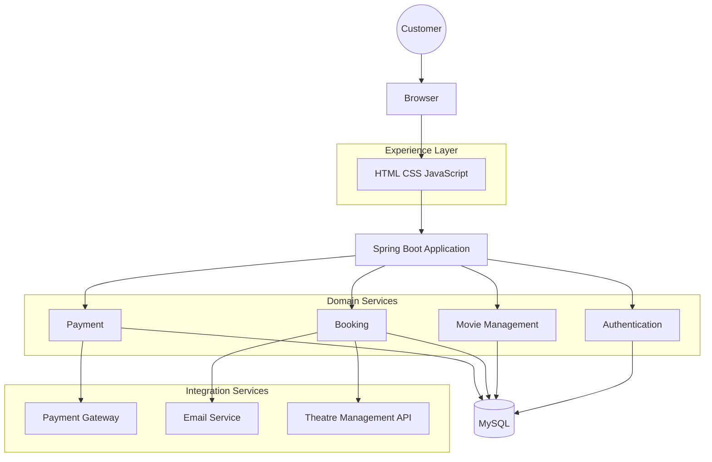

# Deployment Diagram

```mermaid
flowchart TB

User((Customer))

Browser[Browser]

Server[Spring Boot Application]

subgraph Domain Services
Auth[Authentication]
Movie[Movie Management]
Booking[Booking]
Payment[Payment]
end

subgraph Integration Services
PaymentGateway[Payment Gateway]
EmailService[Email Service]
TheatreAPI[Theatre Management API]
end

subgraph Experience Layer
WebUI[HTML CSS JavaScript]
end

Database[(MySQL)]

User --> Browser

Browser --> WebUI

WebUI --> Server

Server --> Auth
Server --> Movie
Server --> Booking
Server --> Payment

Booking --> TheatreAPI
Payment --> PaymentGateway
Booking --> EmailService

Auth --> Database
Movie --> Database
Booking --> Database
Payment --> Database
```