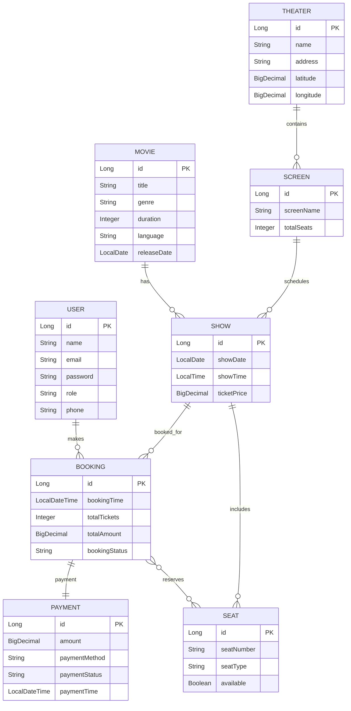

# Movie Ticket Booking System - Entity Relationship Diagram

```mermaid
erDiagram

    USER {
        Long id PK
        String name
        String email
        String password
        String role
        String phone
    }

    MOVIE {
        Long id PK
        String title
        String genre
        Integer duration
        String language
        LocalDate releaseDate
    }

    THEATER {
        Long id PK
        String name
        String address
        BigDecimal latitude
        BigDecimal longitude
    }

    SCREEN {
        Long id PK
        String screenName
        Integer totalSeats
    }

    SHOW {
        Long id PK
        LocalDate showDate
        LocalTime showTime
        BigDecimal ticketPrice
    }

    SEAT {
        Long id PK
        String seatNumber
        String seatType
        Boolean available
    }

    BOOKING {
        Long id PK
        LocalDateTime bookingTime
        Integer totalTickets
        BigDecimal totalAmount
        String bookingStatus
    }

    PAYMENT {
        Long id PK
        BigDecimal amount
        String paymentMethod
        String paymentStatus
        LocalDateTime paymentTime
    }

    USER ||--o{ BOOKING : makes

    MOVIE ||--o{ SHOW : has

    THEATER ||--o{ SCREEN : contains

    SCREEN ||--o{ SHOW : schedules

    SHOW ||--o{ BOOKING : booked_for

    SHOW ||--o{ SEAT : includes

    BOOKING ||--|| PAYMENT : payment

    BOOKING }o--o{ SEAT : reserves
```