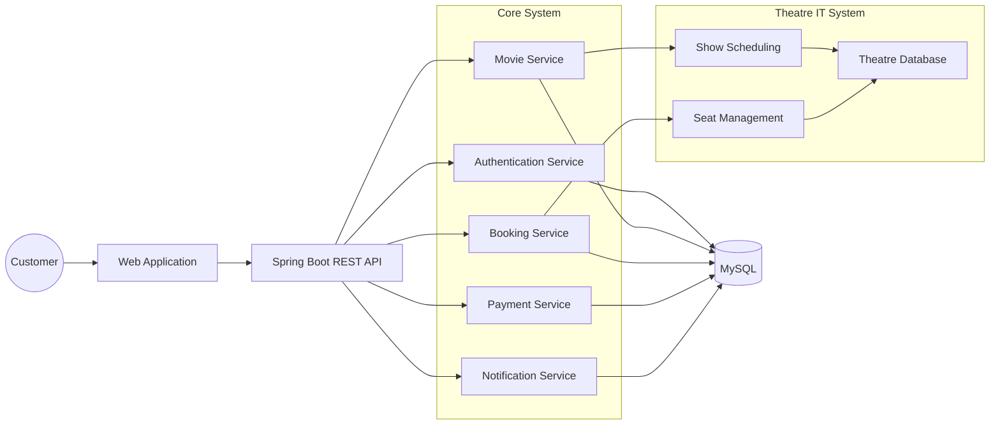

# Flow Chart - Core Systems Integration

```mermaid
flowchart LR

Customer((Customer))

Web[Web Application]

API[Spring Boot REST API]

subgraph Core System
Auth[Authentication Service]
Movie[Movie Service]
Booking[Booking Service]
Payment[Payment Service]
Notification[Notification Service]
end

subgraph Theatre IT System
TheatreDB[Theatre Database]
SeatSystem[Seat Management]
ShowSystem[Show Scheduling]
end

DB[(MySQL)]

Customer --> Web
Web --> API

API --> Auth
API --> Movie
API --> Booking
API --> Payment
API --> Notification

Booking --> SeatSystem
Movie --> ShowSystem
ShowSystem --> TheatreDB
SeatSystem --> TheatreDB

Auth --> DB
Movie --> DB
Booking --> DB
Payment --> DB
Notification --> DB
```