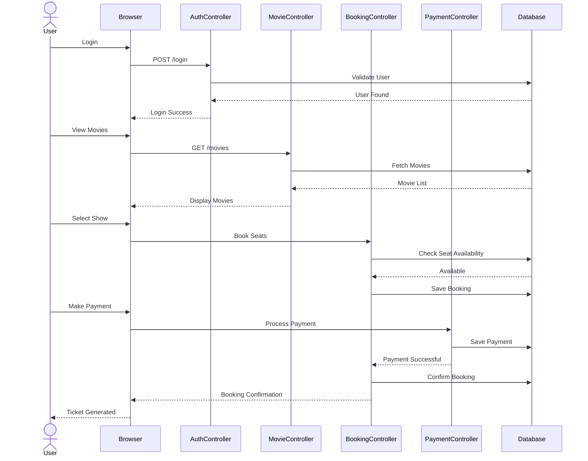

# Sequence Diagram

```mermaid
sequenceDiagram

actor User

participant Browser
participant AuthController
participant MovieController
participant BookingController
participant PaymentController
participant Database

User->>Browser: Login
Browser->>AuthController: POST /login
AuthController->>Database: Validate User
Database-->>AuthController: User Found
AuthController-->>Browser: Login Success

User->>Browser: View Movies
Browser->>MovieController: GET /movies
MovieController->>Database: Fetch Movies
Database-->>MovieController: Movie List
MovieController-->>Browser: Display Movies

User->>Browser: Select Show
Browser->>BookingController: Book Seats
BookingController->>Database: Check Seat Availability
Database-->>BookingController: Available

BookingController->>Database: Save Booking

User->>Browser: Make Payment
Browser->>PaymentController: Process Payment
PaymentController->>Database: Save Payment

PaymentController-->>BookingController: Payment Successful
BookingController->>Database: Confirm Booking

BookingController-->>Browser: Booking Confirmation
Browser-->>User: Ticket Generated
```