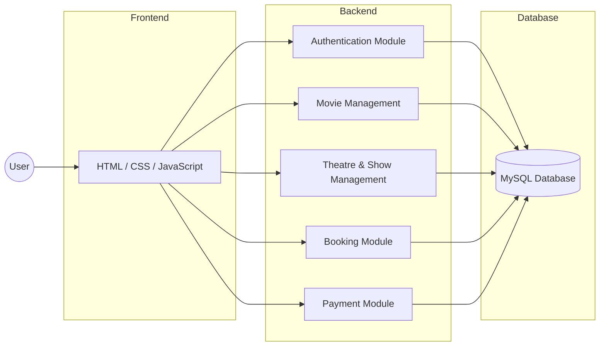

# System Architecture Diagram

```mermaid
flowchart LR

User((User))

subgraph Frontend
    UI[HTML / CSS / JavaScript]
end

subgraph Backend
    Auth[Authentication Module]
    Movie[Movie Management]
    Theatre[Theatre & Show Management]
    Booking[Booking Module]
    Payment[Payment Module]
end

subgraph Database
    DB[(MySQL Database)]
end

User --> UI

UI --> Auth
UI --> Movie
UI --> Theatre
UI --> Booking
UI --> Payment

Auth --> DB
Movie --> DB
Theatre --> DB
Booking --> DB
Payment --> DB
```